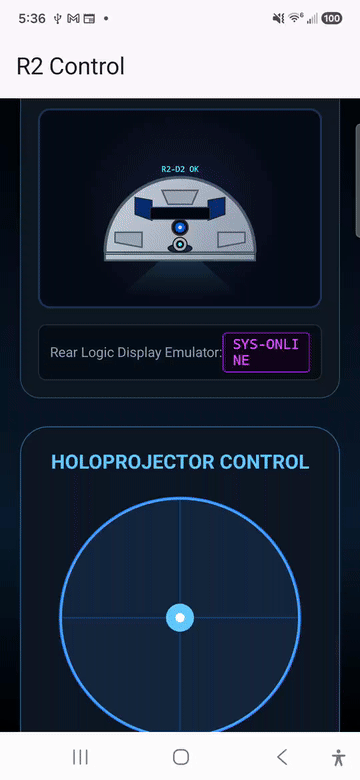

# R2-D2 Astromech Control Panels

A dual Android application and ESP32 firmware system designed to control interactive functions of an R2-D2 astromech dome. The project features Bluetooth Low Energy (BLE) control for holographic projectors, dynamic WS2812B LEDs (PSI status lights), dome pie panels (radar/scanner flaps), and text matrices.

## Interactive App Demonstration

Below is a walkthrough demonstration of the custom Jetpack Compose Android controller app operating the R2-D2 Dome interface:



*(Note: If the GIF does not render, you can view the raw file at `r2controlsapp.gif` inside the repository).*

---

## Astropixels & ReelTwo Library Integration

The project communicates command packets to the **Astropixels** board, which controls the WS2812 RGB LEDs. The Astropixels system runs on an ESP32 controller using the [ReelTwo Library by dpoulson](https://github.com/dpoulson/Reeltwo), combining structural control logic for multiple club-standard sub-systems (Logic Displays, PSI LEDs, and Holoprojector controls).

### Communication Flow
1. The **Android App** pairs with the main **ESP32 Dev Board** via BLE.
2. The main ESP32 parses commands and forwards them via its hardware **Serial2** bus (Pins 16 and 17) to the **Astropixels ESP32** controller.
3. The Astropixels ESP32 running the **ReelTwo library** decodes standard serial commands (e.g., `@AP...` and `@3M...`) and controls the WS2812 LED strings and servos directly.

### Hardware Pinout Configuration (ESP32 Board)

The default 30-pin ESP32 dev board uses the following GPIO pin mapping to connect the dome peripherals:

| Peripheral System | Default GPIO Pin | Description |
| :--- | :---: | :--- |
| **RLD** | `33` | Rear Logic Display Signal (ReelTwo library control) |
| **FLD** | `15` | Front Logic Display Signal (ReelTwo library control) |
| **FPSI** | `32` | Front PSI Status WS2812 RGB LED string |
| **RPSI** | `23` | Rear PSI Status WS2812 RGB LED string |
| **THP** | `27` | Top Holoprojector Servo / Light |
| **RHP** | `26` | Rear Holoprojector Servo / Light |
| **FHP** | `25` | Front Holoprojector Servo / Light |
| **AUX1** | `2` | Auxiliary Port 1 |
| **AUX2** | `4` | Auxiliary Port 2 |
| **AUX3** | `5` | Auxiliary Port 3 |
| **AUX4** | `18` | Auxiliary Port 4 |
| **AUX5** | `19` | Auxiliary Port 5 |
| **Serial2_RX** | `16` | Hardware Serial 2 Receive (to parse main controller packets) |
| **Serial2_TX** | `17` | Hardware Serial 2 Transmit (to parse main controller packets) |

---

## Protocol & BLE Commands

All commands are transmitted as standard new-line terminated UTF-8 strings:

| Command Prefix | Description | Example Payload |
| :--- | :--- | :--- |
| `HOLO:X,Y` | Sets Holoprojector Pan and Tilt servo angles (0-180) | `HOLO:90,90` |
| `LED:HEX` | Updates the main PSI LED colors | `LED:#00ff66` |
| `PANEL_TOP1_ON` / `OFF` | Toggles top radar panel flap state | `PANEL_TOP1_ON` |
| `PANEL_TOP2_ON` / `OFF` | Toggles top scanner panel flap state | `PANEL_TOP2_ON` |
| `PANEL_REAR1_ON` / `OFF` | Toggles rear saber link panel flap state | `PANEL_REAR1_ON` |
| `FLD:TEXT` | Sends string to Front Logic Display | `FLD:R2-D2 OK` |
| `RLD:TEXT` | Sends string to Rear Logic Display | `RLD:SYS-ONLINE` |
| `TEST` | Triggers a full automated diagnostics checklist sweep | `TEST` |

---

## Local Setup & Build

### Prerequisites
- Android Studio Ladybug (or higher)
- JDK 17 (Corretto or equivalent)
- Arduino IDE with ESP32 board manager installed

### Building the Android App
Set `JAVA_HOME` pointing to your local JDK installation and execute the Gradle assembler:
```bash
JAVA_HOME=/path/to/jdk-17 ./gradlew assembleDebug
```
Deploy the generated APK from `app/build/outputs/apk/debug/app-debug.apk` directly to your physical Android device.
